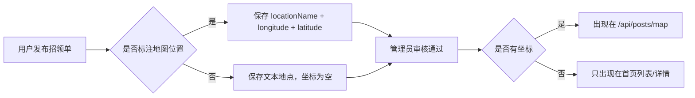

# Sprint 7: 招领地图图钉 — 设计

## 目标

地图用于标注“物品被捡到的位置”，帮助失主按校园地点寻找属于自己的招领单。S7 不把地图做成所有单据的混合展示，也不要求拾到者必须完成地图标注。

确定规则：
- 招领单发布时推荐标注捡到位置，但不强制。
- 地图页只展示有经纬度的招领单。
- 没有经纬度的招领单仍可正常发布、审核、出现在首页列表和详情页。
- 寻物单不进入地图，避免“丢失位置”和“捡到位置”混在一起。

## 后端变更

### 新增 DTO

新增 `MapPostResponse`，专用于公开地图点位接口：

```java
public class MapPostResponse {
    private Long id;
    private String itemName;
    private String itemCategory;
    private String campusArea;
    private String locationName;
    private Double longitude;
    private Double latitude;
    private LocalDateTime eventTime;
}
```

地图接口不得复用 `LostFoundPost` 实体，也不得复用包含更多字段的管理端响应。

### 新增 Service 方法

`LostFoundPostService` 新增：

```java
List<MapPostResponse> listMapPosts();
```

查询条件固定为：
- `post_type = FOUND`
- `status = MATCHING`
- `deleted = 0`
- `longitude IS NOT NULL`
- `latitude IS NOT NULL`

排序使用 `published_at DESC`，与公开列表保持一致。

### 完整实现 Controller 端点

```
GET /api/posts/map
```

返回 `Result<List<MapPostResponse>>`。该接口公开访问，继续保留在 Sa-Token 放行列表。

返回字段只包含地图展示必需信息：
- `id`
- `itemName`
- `itemCategory`
- `campusArea`
- `locationName`
- `longitude`
- `latitude`
- `eventTime`

明确不返回：
- `privateFeature`
- `storageLocation`
- `userId`
- `description`
- `title`
- `status`

## 小程序变更

### 发布招领单

`miniapp/pages/publish-form/` 在 `postType === 'FOUND'` 时显示“捡到位置”区域：

- 保留“具体地点”文本输入，用户仍可手填。
- 增加按钮 `在地图上标注`。
- 点击按钮调用 `wx.chooseLocation()`。
- 选点成功后写入：
  - `form.locationName = result.name || result.address`
  - `form.longitude = result.longitude`
  - `form.latitude = result.latitude`
- 选点成功后在表单中展示已选地点名称和经纬度摘要。
- 用户取消选点或授权失败时，不阻止发布，只提示：`未标注地图位置，单据不会显示在地图中`。

提交 payload：
- 招领单传 `longitude`、`latitude`、`locationName`。
- 未选点时 `longitude/latitude` 为空。
- 寻物单不传坐标或传空坐标。

### 地图页

`miniapp/pages/map/` 改为“招领地图”语义：

- 页面标题使用“地图找招领”。
- 请求 `GET /api/posts/map`。
- 每条响应转成一个 marker。
- 点击 marker 后展示底部卡片，内容为：
  - 物品名称
  - 物品类别
  - 捡到地点
  - 捡到时间
  - `查看详情` 按钮
- 底部卡片点击 `查看详情` 后跳转 `pages/detail/detail?id={id}`。
- 没有点位时显示轻量空态：`暂无已标注位置的招领单`。

地图页不显示寻物单，也不提供寻物/招领切换。

## 数据流



## 错误处理

- `wx.chooseLocation()` 失败或取消：显示提示，不改变已有表单内容。
- `/api/posts/map` 返回空数组：地图页展示空态，不报错。
- 后端遇到坐标为空：该记录不进入地图接口结果，不影响其他记录。
- 点位详情跳转失败：沿用详情页已有错误处理。

## 隐私与安全

地图接口是公开接口，因此必须保持脱敏：
- 不暴露私密特征。
- 不暴露暂存地点。
- 不暴露发布者用户 ID。
- 不暴露描述全文，避免描述里包含个人信息或私密线索。

暂存地点只在认领通过后的 `ClaimResponse.verifiedStorageLocation` 中返回。

## 测试

后端 TDD：
- `LostFoundPostServiceTest.listMapPosts_onlyReturnsMatchingFoundPostsWithCoordinates`
- `LostFoundPostServiceTest.listMapPosts_responseDoesNotExposePrivateFields`
- `LostFoundPostControllerTest.mapPoints_noAuth_returnsFoundMarkers`

小程序手动验证：
- 发布招领单时选择地图位置，payload 包含 `longitude/latitude/locationName`。
- 取消地图选点后仍可提交，payload 不包含坐标。
- 地图页只显示有坐标的招领单。
- 点击图钉后底部卡片显示物品、类别、地点、时间，并可进入详情页。

## 不在范围

- 寻物单地图展示。
- 地图范围筛选、距离排序、附近搜索。
- 反向地理编码自动识别校区。
- 地图上直接发起认领。
- 管理端地图视图。
